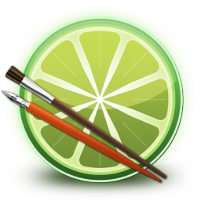

# Paint Tool Sai 2 for Linux Guide (With working pressure sensitivity)
This is a full guide on getting Paint Tool Sai 2 to work under Linux via Bottles & Wine with full tablet pressure sensitivity. Just follow the instructions and you'll be good to go in a few minutes. Credits for this solution goes to [Kuuube](https://kuuuube.github.io/) from the [OpenTabletDriver](https://opentabletdriver.net/) Discord Server.

## 1. Installing Bottles
You can install Bottles by following the instructions for your distribution on their [website](https://usebottles.com/). Usually Flatpak is the simplest the way to go though.

## 2. Installing the runner
Go through the initial setup, then:
- Navigate to **Preferences**

  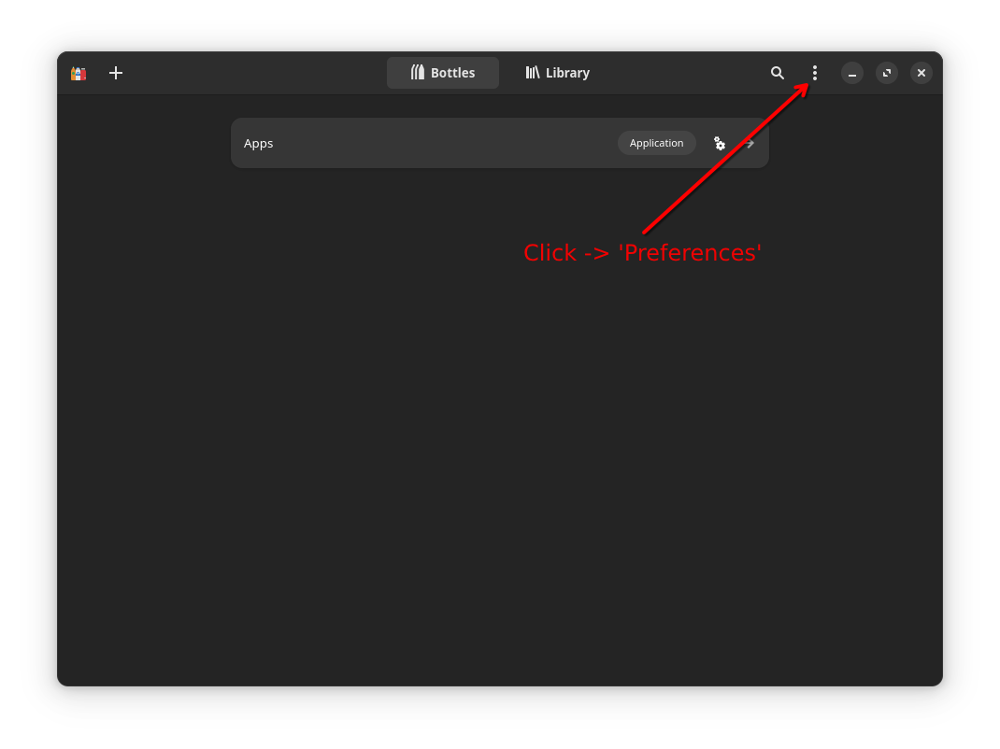

- Navigate to **Runners** -> **Caffe** and install `caffe-9.2`

  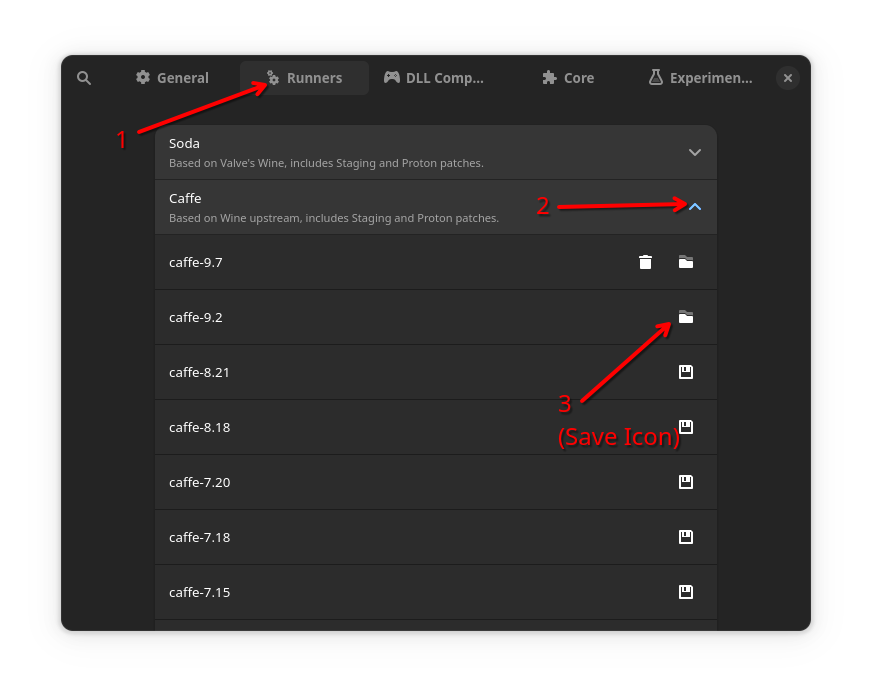

## 3. Creating the bottle
After downloading `caffe-9.2`, navigate back to the main screen, then create a new bottle by clicking the "+" in the top left corner.
- The bottle environment should be 'Application', leave everything else as default.

  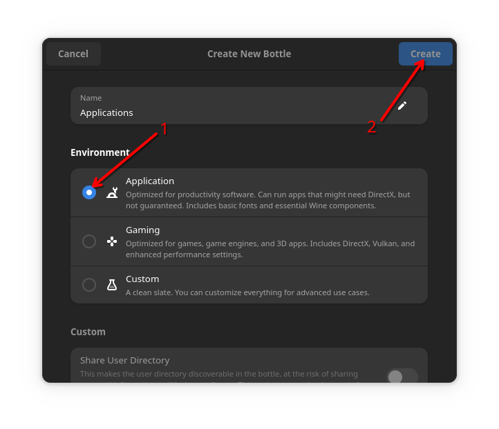

- If successful, you should see a screen like this

  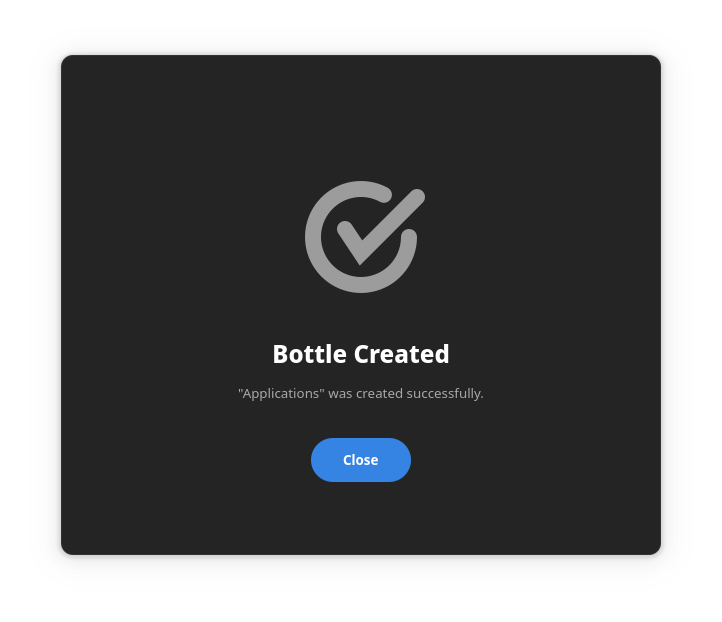

## 4. Configuring the bottle
Once the bottle has been created, we need to change the runner.
- Open your newly created bottle

  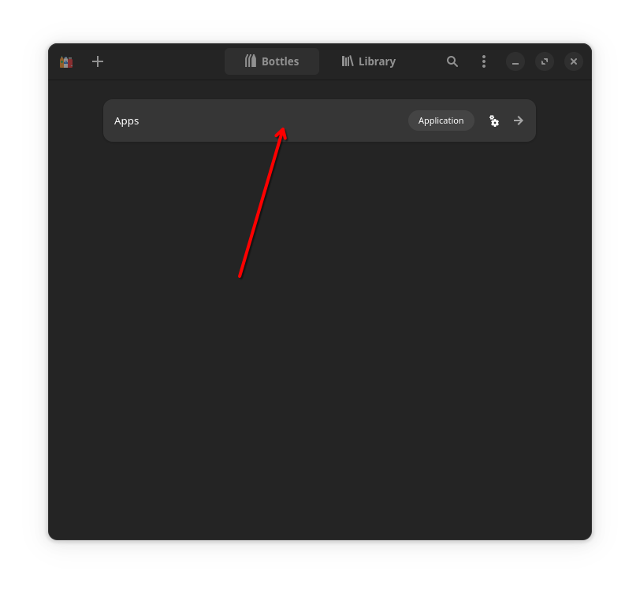

- Click **Settings**

  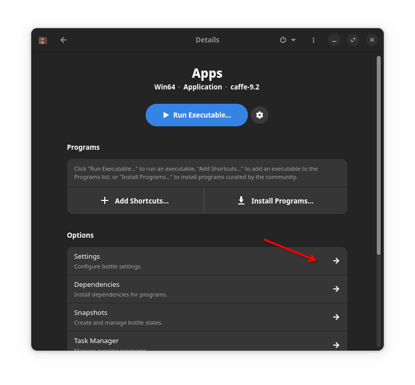

- Change the **Runner** to `caffe-9.2`

  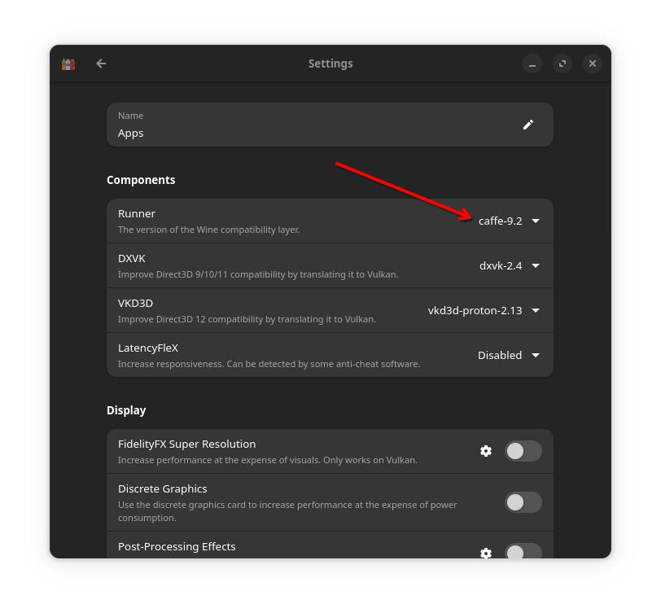

## 5. Running Sai
- Download and extract **Paint Tool Sai 2 64bit** (currently `SAI2 64bit - 2024-08-14 Technical Preview`) from [SYSTEMAX](https://www.systemax.jp/en/sai/devdept.html)
- Click **+ Add Shortcuts...**

  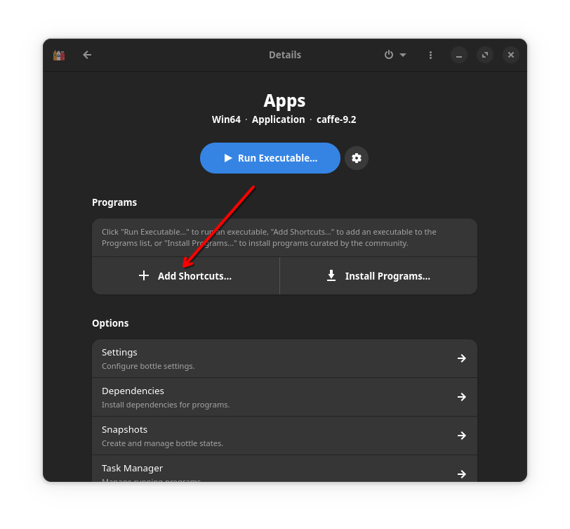

- Locate `sai2.exe` from the extracted archive

  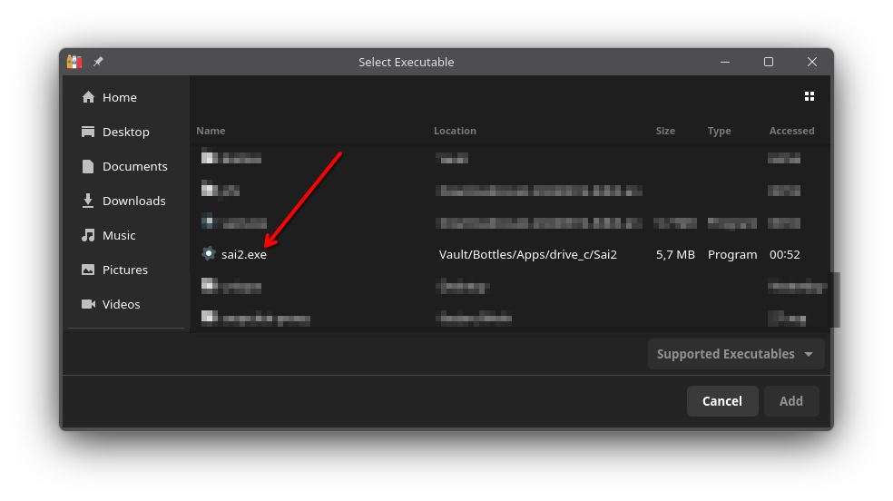

- You should now see `sai2` in your Programs

  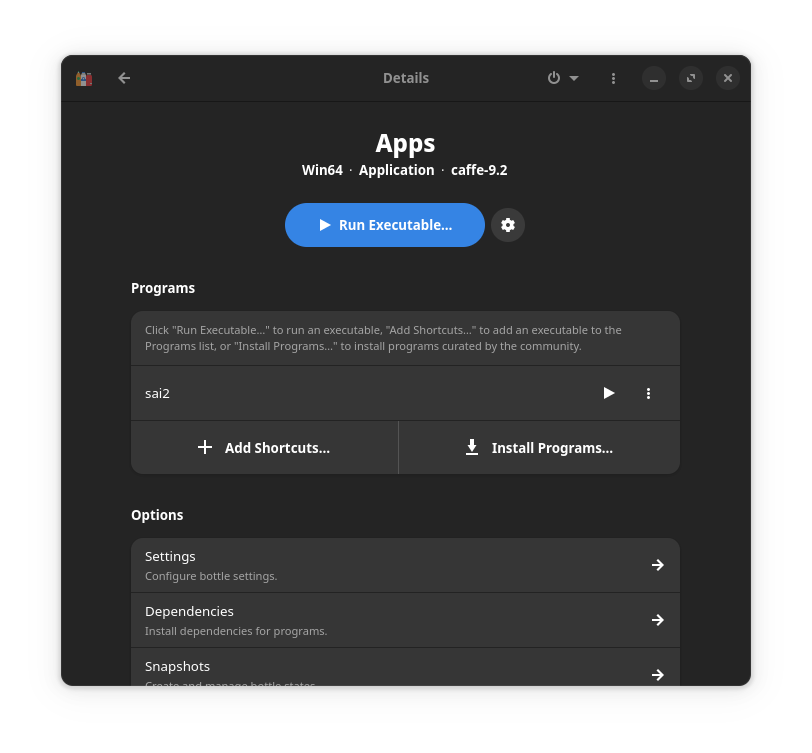

- **Optionally** rename `sai2` to `Paint Tool Sai 2` by going to the three dots on the right, and selecting **Rename**
- **Optionally** add a desktop entry to `sai2` by going to the three dots on the right, and selecting **Add Desktop Entry**
- **Optionally** add `sai2` to Bottles Library by going to the three dots on the right, and selecting **Add to Library**

## 6. Configuring Sai
To fix tablet pressure sensitivity, and random errors popping up, we need to configure a few options
- Start Sai by hitting the **Play** button on the added Program entry (Or by using the Desktop Entry/Library Entry if you've added it)

  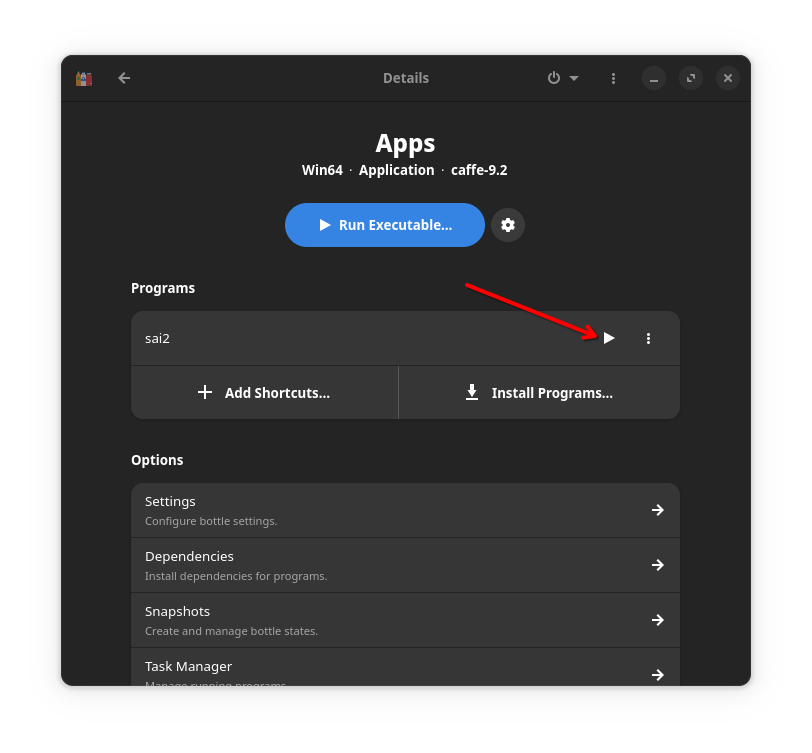

- Navigate to **Other** -> **Options...**

  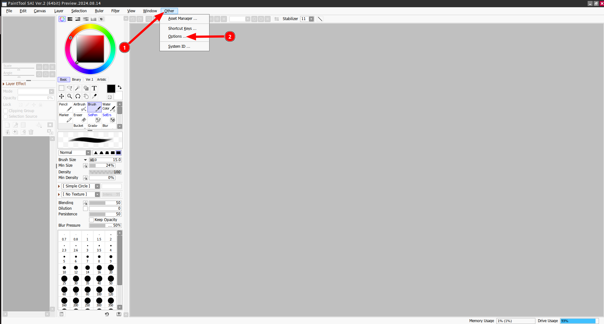

- In the **Pen Tablet** section, pick **Use WinTab API**, then press **OK**

  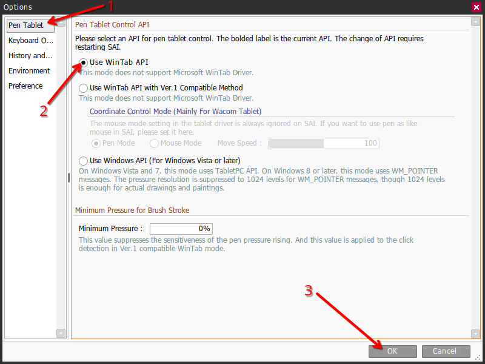

- Navigate to **Other** -> **Options...** again

  

- In the **History and...** section, uncheck the **To suppress memory usage <...>** box, then press **OK**

  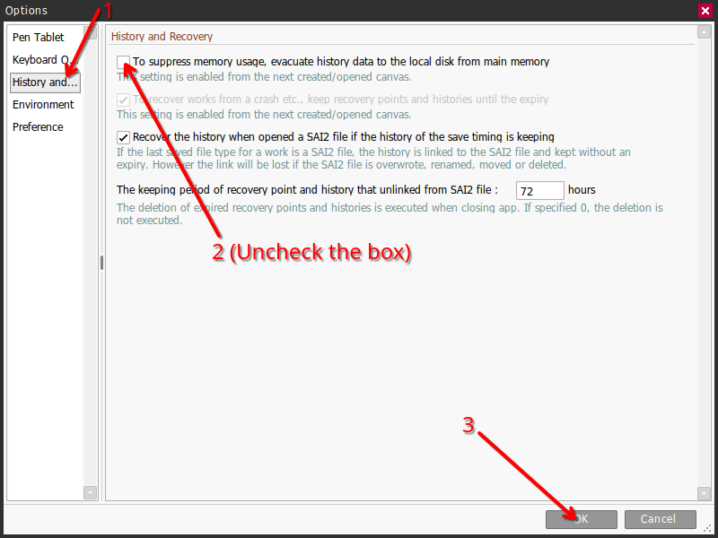

- **IMPORTANT:** Restart Sai

## 7. Enjoy!
- After you've restarted Sai, everything should be working as expected
- If pressure sensitivity is still not working, make sure your tablet drivers are running, and if possible, use [OpenTabletDriver](https://opentabletdriver.net/)

  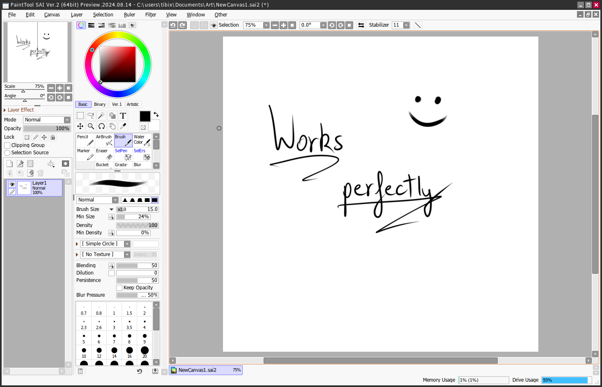

## Additional Notes
- Putting Sai into fullscreen mode can cause an offset on the mouse. To avoid this:
    - Increase the size of the window to fit the screen instead of making it fullscreen 
    - Fullscreen Sai using F11 to remove the titlebar
- When creating a new canvas, if Sai is not on the primary monitor it may not render the canvas. In this case, switch the window to fullscreen and then back to windowed to re-render the canvas.
- If you want to skip a few of these steps and you're familiar with Bottles, you may import `sai.yml` and start from there